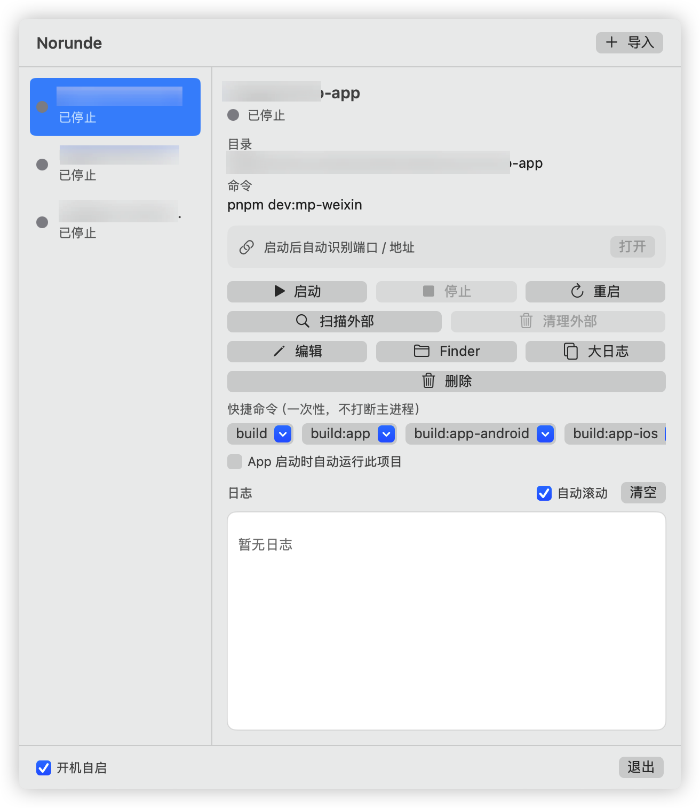

# Norunde

macOS 菜单栏工具：统一管理本地 Node 前端项目的导入、启动命令、进程启停与实时日志。

[](LICENSE)
[](#要求)
[](#要求)
[](https://github.com/shirenran/norunde/releases)

> 状态：早期开源（MVP）。已提供 DMG 下载；ad-hoc 签名，尚未 Apple 公证。

## 截图

<p align="center">
  
</p>

主面板：左侧项目列表与状态，右侧启动命令 / 启停 / 快捷命令 / 实时日志，底部开机自启。

## 适用范围

Norunde 面向 **本机日常开发** 的轻量场景：把多个前端 dev server 收进菜单栏，少开几个终端窗口。

### 适合

| 场景 | 说明 |
|---|---|
| 本地 Node 前端项目 | 有 `package.json`，用 `pnpm` / `npm` / `yarn` / `bun` 跑 `dev` / `start` 等 |
| 同时管多个项目 | 例如主站 + 管理端 + 小程序，列表里分别启停、看日志 |
| 菜单栏常驻 | 不占 Dock，需要时点一下看状态 / 日志 / Local URL |
| 本机 shell 工具链 | 依赖你已在终端里装好的 Node、包管理器、环境变量（login shell PATH） |
| 一次性构建命令 | 快捷命令跑 `build` / `test` 等，不打断主 dev 进程 |
| 个人 / 小团队本机 | 配置只在本机 `Application Support`，不上传 |

常见栈示例：Vite / Webpack / Next / Nuxt / Vue CLI / Create React App、uni-app / 各类 `pnpm dev:*` 脚本等——只要最终是「在项目目录执行一条 shell 命令」。

### 不太适合 / 明确不做

| 场景 | 说明 |
|---|---|
| 非 macOS | 仅 macOS 14+ |
| 无 `package.json` 的纯后端 / 任意二进制 | 导入与脚本发现围绕 Node 前端；虽可手填命令，但不是通用进程管理器 |
| Docker / 远程服务器 / SSH | 不做容器编排、远程项目 |
| 生产部署、CI、集群 | 只服务本机开发态 |
| 需要完整 IDE / 调试器 | 不替代 VS Code / Xcode，不管断点调试 |
| 全局快捷键、日志落盘检索 | MVP 未做 |
| 子进程已 daemon 化并脱离父子关系 | 停止时会尽量清进程树，极端情况仍可能要 Activity Monitor 手动结束 |

**一句话**：适合「本机好几个前端项目来回 `pnpm dev`」的开发者；不适合当 Docker 面板、远程运维台或通用系统服务管理器。

## 功能

- 常驻菜单栏，不进 Dock（`LSUIElement`）
- 导入项目时解析 `package.json` scripts，按 lockfile 推断包管理器
- 通过 login shell PATH 启动（解决菜单栏 App 找不到 `pnpm` / `npm` 的问题）
- 停止时清理子进程树（SIGTERM → 超时 SIGKILL；setpgid 成功则杀进程组，否则递归 pgrep 树）
- 实时日志、Local URL 识别、快捷命令、开机自启
- 配置保存在 `~/Library/Application Support/Norunde/projects.json`

## 要求

- macOS 14+
- Xcode 15+（Swift 5.9+，已在 Swift 6.1 验证编译）**或** 仅 Command Line Tools + macOS SDK
- 本机已安装对应包管理器（pnpm / npm / yarn / bun）

## 安装

### 下载 DMG（推荐）

1. 打开 [Releases](https://github.com/shirenran/norunde/releases) 下载 `Norunde-*.dmg`
2. 打开 DMG，将 **Norunde** 拖到 **Applications**
3. 首次若被拦截：Finder 中右键 App → **打开**
4. 菜单栏找 **shippingbox（箱子）** 图标

> 当前 Release 为 **ad-hoc 签名、未 Apple 公证**。Intel / Apple Silicon 通用二进制（macOS 14+）。

### 从源码

```bash
git clone https://github.com/shirenran/norunde.git
cd norunde
bash scripts/install.sh --login   # 构建并装到 ~/Applications，可选开机自启
open ~/Applications/Norunde.app
```

- 底部可勾选 **开机自启**
- 关闭开机自启：取消勾选，或删除 `~/Library/LaunchAgents/app.norunde.login.plist`

### 维护者：打 DMG 并发布 Release

```bash
VERSION=0.1.0 bash scripts/release.sh
# 或只打包不上传：
VERSION=0.1.0 bash scripts/package-dmg.sh
```

## 开发构建

### 完整 Xcode

```bash
cd App/Norunde
xcodebuild -project Norunde.xcodeproj -scheme Norunde -configuration Debug build
xcodebuild -project Norunde.xcodeproj -scheme Norunde -destination 'platform=macOS' test
```

或用 Xcode 打开 `App/Norunde/Norunde.xcodeproj`，选中 scheme **Norunde** 后 Run（⌘R）。

### 仅 Command Line Tools（无完整 Xcode）

```bash
bash scripts/build-app.sh
swift scripts/smoke-logic.swift
open build/Norunde.app
```

产物：`build/Norunde.app`（开发调试用；日常请用 `scripts/install.sh` 装到 `~/Applications`）

## 使用

1. 点击菜单栏 **shippingbox** 图标打开面板
2. 点 **导入** 选择前端项目目录
3. 确认名称 / 启动命令（可点脚本快捷按钮）与可选环境变量 `KEY=VALUE`
4. 保存后在列表中 **启动 / 停止 / 重启**
5. 右侧查看实时日志（`http` 链接可点击），可清空；识别到 Local URL 后可 **打开 / 复制**
6. 可勾选 **App 启动时自动运行此项目**
7. **快捷命令**：编辑页可添加 build/test 等；详情页点命令可「运行一次」或「设为主启动」
8. **大日志**：详情页打开独立大窗口看日志 / 启停
9. 底部 **开机自启** / **退出**（退出会停止所有托管进程）
10. 应用保持单实例：重复打开会激活已有进程

## 配置

路径：`~/Library/Application Support/Norunde/projects.json`

- 仅持久化项目配置；运行状态不保存
- App 重启后所有项目视为 `stopped`，**不会**自动启动（除非项目勾了「App 启动时自动运行」）
- 配置损坏时可删除该文件重置

## 隐私

- 纯本地工具：不联网、不上传项目路径 / 日志 / 配置
- 仅读写你导入的项目目录与本机 shell 工具链
- App Sandbox **关闭**（需访问任意项目路径与 shell 工具链）

## 工程结构

```text
App/Norunde/
├── Norunde.xcodeproj
├── Norunde/
│   ├── App/                 # 入口 MenuBarExtra + AppDelegate
│   ├── Models/              # Project / Status / AppConfig
│   ├── Services/            # Store / Process / Log / package.json / PATH
│   ├── ViewModels/          # AppViewModel
│   ├── Views/               # 列表、详情、编辑、日志
│   ├── Resources/           # Info.plist / Assets / entitlements
│   └── Utilities/
└── NorundeTests/
```

## 说明与限制（MVP）

- Bundle ID：`app.norunde`
- 不做：全局快捷键、Docker、远程项目、日志落盘检索
- 停止时会递归清理 shell 子进程树；若子进程 daemon 化/脱离父子关系，可能仍需 Activity Monitor 手动清理

### 从个人预览版迁移

若你曾使用旧 Bundle ID `dev.shirenran.norunde`：

- 项目配置目录仍是 `~/Library/Application Support/Norunde/`，**无需迁移**
- 开机自启 label 已改为 `app.norunde.login`；在 App 内重新开关「开机自启」，或重新执行 `bash scripts/install.sh --login`，会自动清理旧 LaunchAgent

## 贡献

欢迎 Issue / PR。当前优先：

- 复现步骤清晰的 bug
- 进程启停 / PATH / package.json 解析相关修复
- 文档与截图

开发前请在本机跑通：

```bash
bash scripts/build-app.sh
swift scripts/smoke-logic.swift
# 有完整 Xcode 时：
cd App/Norunde && xcodebuild -project Norunde.xcodeproj -scheme Norunde -destination 'platform=macOS' test
```

## License

[MIT](LICENSE)
